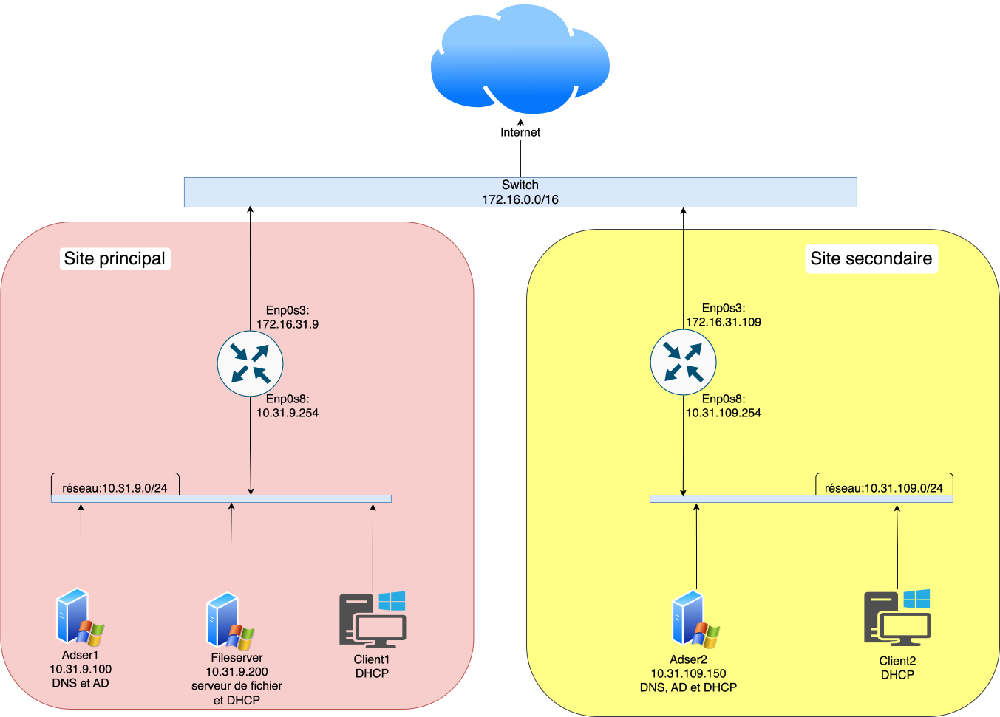
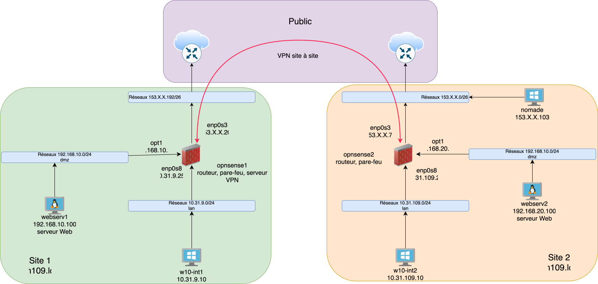
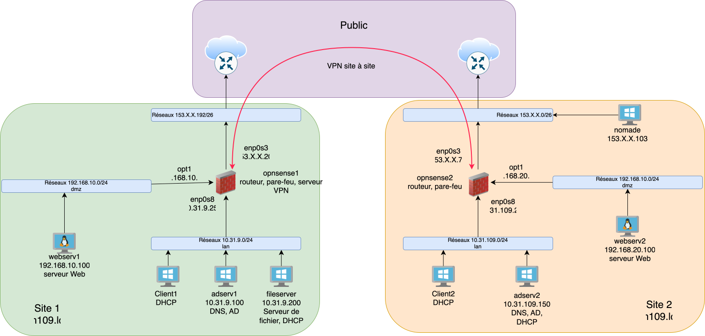

# :material-router-network: Projet Multi-sites

## Infrastructure réseau multi-sites avec services centralisés

---

## :material-information: Description

!!! success "Objectif du projet"

    Mise en place d'un réseau multi-sites avec des exigences de services à mettre en place :
    
    - :material-server: Serveur Active Directory
    - :material-folder-network: Serveur de fichiers
    - :material-dns: DNS
    - :material-router-network: DHCP
    - :material-web: Application web
    
    Le projet a été découpé en plusieurs maquettes pour mieux gérer les risques et identifier les problèmes plus rapidement.

---

## :material-tools: Compétences et Technologies

### :material-lightbulb-on: Compétences

- :material-cog: Administration système 
- :material-shield-lock: Sécurité des réseaux
- :material-vpn: Configuration VPN
- :material-account-group: Gestion Active Directory

Administration
Sécurité

### :material-code-tags: Technologies

- :material-router-network: OPNsense
- :material-microsoft-windows: Active Directory
- :material-server: Windows Server
- :material-vpn: VPN
- :material-dns: DNS
- :material-router-network: DHCP
- :material-web: Apache

OPNsense
Windows Server
Active Directory
Apache

---

## :material-view-dashboard: Maquettes du projet

=== ":material-numeric-1-circle: Maquette 1 : Infrastructure locale"

    !!! tip "Phase 1 : Infrastructure de base"
    
        Mise en place de l'infrastructure sur un réseau local
    
        - :material-server: Déploiement d'un serveur AD
        - :material-cog: Déploiement des différents services (DNS, DHCP, Serveur de fichier, etc...)
        - :material-account-plus: Création des différents utilisateurs et groupes
        - :material-shield-lock: Mise en place des différentes règles de sécurité
        - :material-shield-alert: Mise en place des différentes GPO
    
    <figure markdown="span" class="parallax-image">
      { width="800" }
      <figcaption>:material-information: Architecture de la maquette 1 - Infrastructure locale</figcaption>
    </figure>

=== ":material-numeric-2-circle: Maquette 2 : Interconnexion des Sites"

    !!! tip "Phase 2 : Connexion inter-sites"
    
        Mise en place de l'interconnexion entre les différents sites sans les services
    
        - :material-router-network: Configuration des routeurs pour l'interconnexion entre les différents sites
        - :material-shield-alert: Création d'une DMZ pour l'exposition des serveurs web
        - :material-vpn: Création d'un VPN pour l'accès aux serveurs distants
    
    <figure markdown="span" class="parallax-image">
      { width="800" }
      <figcaption>:material-information: Architecture de la maquette 2 - Interconnexion des sites</figcaption>
    </figure>

=== ":material-numeric-3-circle: Maquette 3 : Services Distants"

    !!! success "Phase 3 : Finalisation"
    
        Ajout des services dans les sites distants
    
        - :material-server-network: Mise en place des services dans la configuration finale
        - :material-shield-alert: Mise en place de nouvelles GPO
    
    <figure markdown="span" class="parallax-image">
      { width="800" }
      <figcaption>:material-information: Architecture de la maquette 3 - Configuration finale</figcaption>
    </figure>

---

## :material-check-circle: Résultats

!!! success "Bilan du projet"

    - :material-check: Infrastructure multi-sites fonctionnelle
    - :material-check: Services centralisés opérationnels
    - :material-check: Sécurité renforcée avec DMZ et VPN
    - :material-check: Gestion centralisée avec Active Directory

---

[:material-arrow-left: Retour aux projets](index.md){ .md-button }

---

*Dernière mise à jour : Janvier 2025*